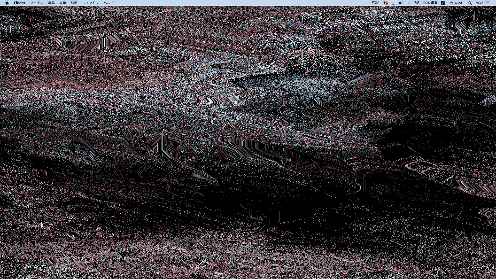
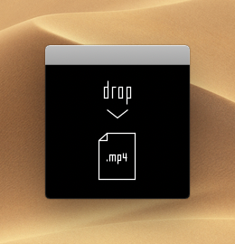

# FDM

Tokisato Miztsuru 2018

### Requirements

MacBook Pro 2016+   
macOS Mojave+

### Download
[https://github.com/mizt/FDM/archive/0.1.0.zip](https://github.com/mizt/FDM/archive/0.1.0.zip)

### Note

Go to `System Preferences` > `Security & Privacy`. Then select the `App Store and identified developers` radio button beneath Allow applications downloaded from.

### Play

Open `FDM.app` and drop .mp4 in the window.    
(Automatically fits to 1920x1080 resolution)   

    
Try mouse down.
